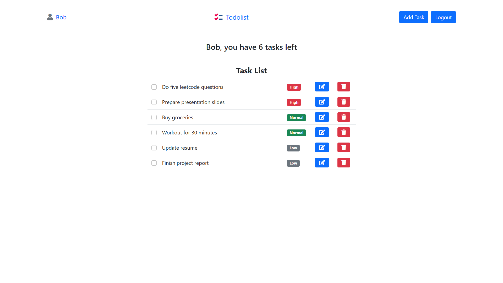

# TodoList

A simple to-do list web application that helps users efficiently manage tasks. Users can add, update, complete, and delete tasks with ease. Built with MongoDB, Express.js, and EJS, the app is deployed on Render for accessibility.

**Live Project:** [TodoList](https://todolist-gc7w.onrender.com)



## How It's Made:

**Tech Stack:**
- **Backend:** Node.js, Express.js
- **Frontend:** EJS (Embedded JavaScript), CSS
- **Database:** MongoDB (Mongoose ORM)
- **Deployment:** Render

### Features:
- **Task Management:** Users can add new tasks, edit them, mark them as completed, or delete them.
- **Persistent Data Storage:** All tasks are stored in a MongoDB database, ensuring that they remain available even after refreshing the page.
- **Dynamic UI:** The UI updates dynamically using EJS templates to reflect task changes in real time.
- **Minimalistic and Responsive Design:** A clean, modern design that works seamlessly on different screen sizes.

## Use Cases
This application is useful for:
- Individuals looking to manage daily tasks and stay organized.
- Students tracking their assignments or study plans.
- Small teams coordinating simple to-do lists for projects.

## Optimizations (Planned Future Improvements)
- **User Authentication:** Adding login/logout functionality so users can have personalized task lists.
- **Improved UI/UX:** Migrating from EJS to a modern frontend framework such as React for a more interactive experience.
- **Categories & Prioritization:** Allowing users to categorize tasks and set priority levels.
- **Due Dates & Reminders:** Integrating due dates with optional email notifications or alerts.
- **Drag-and-Drop Interface:** Enhancing the user experience by enabling drag-and-drop functionality for task sorting.
- **Optimized Performance:** Improving database queries and implementing caching for faster load times.

## Lessons Learned
- Implementing MVC architecture in a full-stack project.
- Enhancing UI with creative design choices.
- Deploying a full-stack app on Render.
- Handling CRUD operations effectively with MongoDB and Express.

## To Run This Project on Your Machine
1. Clone the repository:
   ```sh
   git clone https://github.com/ayushsaxena0/TodoList.git
   ```
2. Install dependencies:
   ```sh
   npm install
   ```
3. Configure environment variables:
   - Create a `.env` file in the root directory.
   - Add `DB_STRING=<your_mongodb_connection_string>`.
4. Run the application:
   ```sh
   npm start
   ```
5. Open `http://localhost:3000` in your browser.

---

Feel free to contribute, suggest improvements, or report issues!

